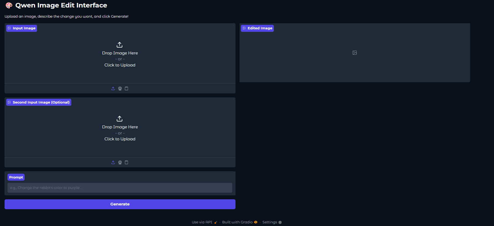

# 🎨 Qwen Image Editor with Gradio UI

This project provides a user-friendly web interface for the powerful **Qwen-Image-Edit** model, allowing you to perform sophisticated, instruction-based image editing directly in your browser. The application is built with Gradio and is optimized to run locally on AMD GPUs using the ROCm software stack.

## 🌟 Features

- **Interactive Web UI**: Easily upload an image, type a text prompt describing your desired edit, and see the result in real-time.
- **State-of-the-Art Model**: Powered by Alibaba's Qwen-Image-Edit, capable of complex semantic and appearance-based editing.
- **AMD ROCm Ready**: Specifically configured and tested to run on AMD Instinct MI300X GPUs with ROCm 6.4.
- **Local & Secure**: Your images are processed locally on your own server, ensuring privacy.
- **Accessible on Your Network**: The server is configured to be accessible from any device on your local network.

## ⚠️ Important Note

This application is configured to run the model in full **float32** precision. During testing on an AMD MI300X, running the model with `bfloat16` precision caused instability ("Segmentation fault" errors). The current configuration ensures stable performance.
